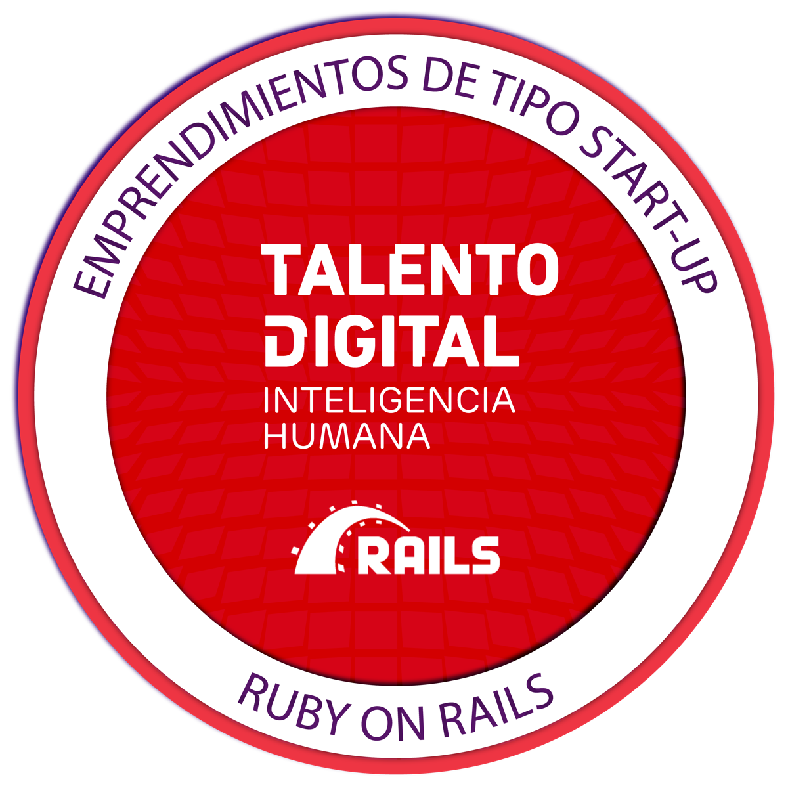
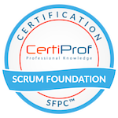

## 🌸About me🌸

Developer and Multimedia Designer, I'm always on the move searching for everything I find interesting. I believe that the greatest findings comes from cross-disciplinary approachments.

## Good with 🎀

- Motion Graphics
- Design systems
- Editorial design
- Making Rails Apps
- Learning stuff

## Learning... 📚

- Apply Math in my projects
- Drawing and Illustration
- Work with Data Structures
- Planning for microservices architectures
- Interactivity with Javascript
- Basic electronics with C and C++

## Currently 🌟

- Studiying at a Java Bootcamp
- Doing Udemy certificates
- Working as backend and UX/UI designer

## My certificates 💎

## 📫 How to reach me:

The only way is by email.
erickthomasriv@gmail.com

_It's all over if you're satisfied with where you stand._

## Contribuitor
Nano Blanco
> ✨ アイ-カツ! アイ-カツ!✨

## Contribuitor

Reynaldo J Blanco M
